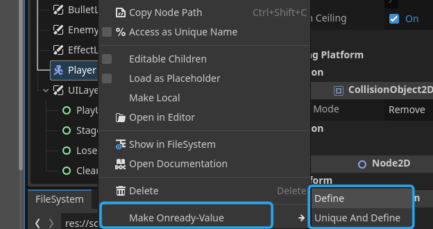
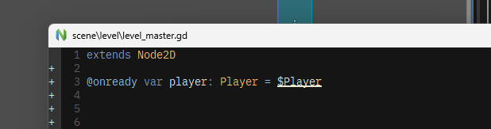

godot-script_aux
---

# 概要
自分用に組んだエディタ拡張。 
(現状はシーンのノードをスクリプトに@onreadyの形で追加する機能のみ) 
Godot内のエディタではドラッグアンドドロップで出来るけど外部エディタの場合はそうも行かないので作ってみた。

# インストール
godotプロジェクトディレクトリのaddonsに置く

# 使い方

ノードツリーでノードを右クリックすると、スクリプトにメンバ変数が宣言される。

宣言される位置は固定なので各自なんとかしてください。
